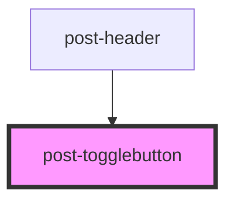

# post-togglebutton

<!-- Auto Generated Below -->

## Properties

| Property  | Attribute | Description                                                                     | Type      | Default |
| --------- | --------- | ------------------------------------------------------------------------------- | --------- | ------- |
| `toggled` | `toggled` | If `true`, the button is in the "on" state, otherwise it is in the "off" state. | `boolean` | `false` |

## Slots

| Slot        | Description                         |
| ----------- | ----------------------------------- |
| `"default"` | Slot for the content of the button. |

## Dependencies

### Used by

 - [post-header](../post-header)

### Graph

----------------------------------------------

*Built with [StencilJS](https://stenciljs.com/)*
