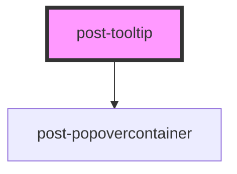

# post-tooltip

<!-- Auto Generated Below -->

## Properties

| Property    | Attribute   | Description                                                                                                                                                                                                                                                                                                               | Type                                                                                                                                                                 | Default |
| ----------- | ----------- | ------------------------------------------------------------------------------------------------------------------------------------------------------------------------------------------------------------------------------------------------------------------------------------------------------------------------- | -------------------------------------------------------------------------------------------------------------------------------------------------------------------- | ------- |
| `arrow`     | `arrow`     | Wheter or not to display a little pointer arrow                                                                                                                                                                                                                                                                           | `boolean`                                                                                                                                                            | `true`  |
| `delayed`   | `delayed`   | If `true`, the tooltip is displayed a few milliseconds after it is triggered                                                                                                                                                                                                                                              | `boolean`                                                                                                                                                            | `false` |
| `placement` | `placement` | Defines the placement of the tooltip according to the floating-ui options available at https://floating-ui.com/docs/computePosition#placement. Tooltips are automatically flipped to the opposite side if there is not enough available space and are shifted towards the viewport if they would overlap edge boundaries. | `"bottom" \| "bottom-end" \| "bottom-start" \| "left" \| "left-end" \| "left-start" \| "right" \| "right-end" \| "right-start" \| "top" \| "top-end" \| "top-start"` | `'top'` |

## Methods

### `hide() => Promise<void>`

Programmatically hide this tooltip

#### Returns

Type: `Promise<void>`

### `show(target: HTMLElement, triggeredByFocus?: boolean) => Promise<void>`

Programmatically display the tooltip

#### Parameters

| Name               | Type          | Description                                                                  |
| ------------------ | ------------- | ---------------------------------------------------------------------------- |
| `target`           | `HTMLElement` | An element with [data-tooltip-target="id"] where the tooltip should be shown |
| `triggeredByFocus` | `boolean`     | A boolean indicating if the tooltip was triggered by a focus event.          |

#### Returns

Type: `Promise<void>`

### `toggle(target: HTMLElement, force?: boolean) => Promise<void>`

Toggle tooltip display

#### Parameters

| Name     | Type          | Description                                                                  |
| -------- | ------------- | ---------------------------------------------------------------------------- |
| `target` | `HTMLElement` | An element with [data-tooltip-target="id"] where the tooltip should be shown |
| `force`  | `boolean`     | Pass true to always show or false to always hide                             |

#### Returns

Type: `Promise<void>`

## Dependencies

### Depends on

- [post-popovercontainer](../post-popovercontainer)

### Graph

----------------------------------------------

*Built with [StencilJS](https://stenciljs.com/)*