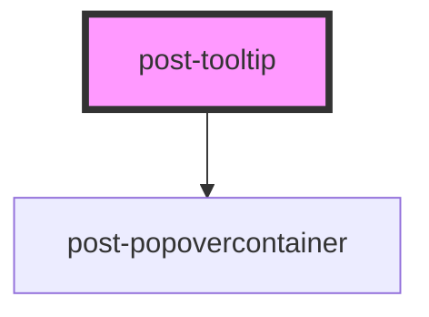

# post-tooltip

<!-- Auto Generated Below -->

## Properties

| Property    | Attribute   | Description                                                                                                                                                                                                                                                                                                               | Type                                                                                                                                                                 | Default    |
| ----------- | ----------- | ------------------------------------------------------------------------------------------------------------------------------------------------------------------------------------------------------------------------------------------------------------------------------------------------------------------------- | -------------------------------------------------------------------------------------------------------------------------------------------------------------------- | ---------- |
| `animation` | `animation` | Choose a tooltip animation                                                                                                                                                                                                                                                                                                | `"pop-in"`                                                                                                                                                           | `'pop-in'` |
| `arrow`     | `arrow`     | Whether or not to display a little pointer arrow                                                                                                                                                                                                                                                                          | `boolean`                                                                                                                                                            | `false`    |
| `delayed`   | `delayed`   | If `true`, the tooltip is displayed a few milliseconds after it is triggered                                                                                                                                                                                                                                              | `boolean`                                                                                                                                                            | `false`    |
| `open`      | `open`      | Indicates the open state of the tooltip                                                                                                                                                                                                                                                                                   | `boolean`                                                                                                                                                            | `false`    |
| `placement` | `placement` | Defines the placement of the tooltip according to the floating-ui options available at https://floating-ui.com/docs/computePosition#placement. Tooltips are automatically flipped to the opposite side if there is not enough available space and are shifted towards the viewport if they would overlap edge boundaries. | `"bottom" \| "bottom-end" \| "bottom-start" \| "left" \| "left-end" \| "left-start" \| "right" \| "right-end" \| "right-start" \| "top" \| "top-end" \| "top-start"` | `'top'`    |

## Methods

### `hide() => Promise<void>`

Programmatically hide this tooltip.
Clears any pending delay timeout.

#### Returns

Type: `Promise<void>`

### `show(target: HTMLElement) => Promise<void>`

Programmatically display the tooltip.
If delayed is true, waits OPEN_DELAY milliseconds before showing.

#### Parameters

| Name     | Type          | Description                                  |
| -------- | ------------- | -------------------------------------------- |
| `target` | `HTMLElement` | An element where the tooltip should be shown |

#### Returns

Type: `Promise<void>`

### `toggle(target: HTMLElement, force?: boolean) => Promise<void>`

Toggle tooltip display.
Clears any pending delay timeout before toggling.

#### Parameters

| Name     | Type          | Description                                      |
| -------- | ------------- | ------------------------------------------------ |
| `target` | `HTMLElement` | An element where the tooltip should be shown     |
| `force`  | `boolean`     | Pass true to always show or false to always hide |

#### Returns

Type: `Promise<void>`

## Slots

| Slot        | Description                          |
| ----------- | ------------------------------------ |
| `"default"` | Slot for the content of the tooltip. |

## Dependencies

### Depends on

- [post-popovercontainer](../post-popovercontainer)

### Graph

----------------------------------------------

*Built with [StencilJS](https://stenciljs.com/)*
