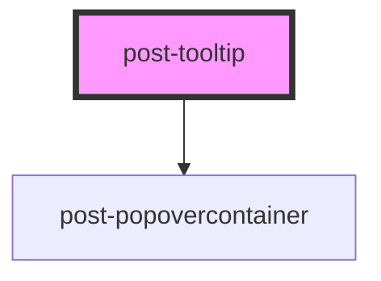

# post-tooltip

<!-- Auto Generated Below -->

## Properties

| Property    | Attribute   | Description                                                                                                                                                                                                                                                                                                                                                                               | Type                                                                                                                                                                 | Default |
| ----------- | ----------- | ----------------------------------------------------------------------------------------------------------------------------------------------------------------------------------------------------------------------------------------------------------------------------------------------------------------------------------------------------------------------------------------- | -------------------------------------------------------------------------------------------------------------------------------------------------------------------- | ------- |
| `arrow`     | `arrow`     | Whether or not to display a little pointer arrow                                                                                                                                                                                                                                                                                                                                          | `boolean`                                                                                                                                                            | `false` |
| `open`      | `open`      | Indicates the open state of the tooltip                                                                                                                                                                                                                                                                                                                                                   | `boolean`                                                                                                                                                            | `false` |
| `placement` | `placement` | Defines the position of the tooltip relative to its trigger. Tooltips are automatically flipped to the opposite side if there is not enough available space and are shifted towards the viewport if they would overlap edge boundaries. For supported values and behavior details, see the [Floating UI placement documentation](https://floating-ui.com/docs/computePosition#placement). | `"bottom" \| "bottom-end" \| "bottom-start" \| "left" \| "left-end" \| "left-start" \| "right" \| "right-end" \| "right-start" \| "top" \| "top-end" \| "top-start"` | `'top'` |

## Methods

### `hide() => Promise<void>`

Programmatically hide this tooltip.

#### Returns

Type: `Promise<void>`

### `show(target: HTMLElement) => Promise<void>`

Programmatically display the tooltip,
`target` is the HTML element the menu is anchored to.

#### Parameters

| Name     | Type          | Description |
| -------- | ------------- | ----------- |
| `target` | `HTMLElement` |             |

#### Returns

Type: `Promise<void>`

### `toggle(target: HTMLElement, force?: boolean) => Promise<void>`

Toggle tooltip display,
`target` is the HTML element the menu is anchored to.

#### Parameters

| Name     | Type          | Description |
| -------- | ------------- | ----------- |
| `target` | `HTMLElement` |             |
| `force`  | `boolean`     |             |

#### Returns

Type: `Promise<void>`

## Dependencies

### Depends on

- [post-popovercontainer](../post-popovercontainer)

### Graph

```mermaid
graph TD;
  post-tooltip --> post-popovercontainer
  style post-tooltip fill:#f9f,stroke:#333,stroke-width:4px
```

---

_Built with [StencilJS](https://stenciljs.com/)_
