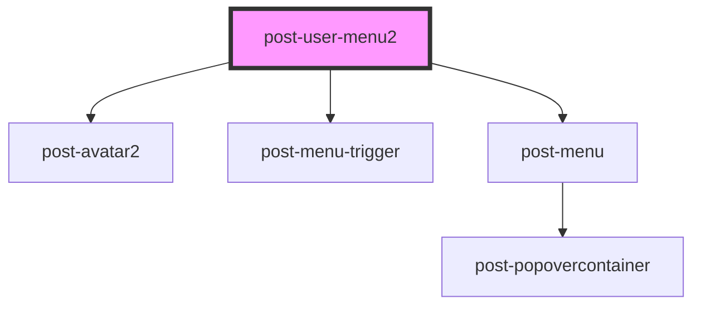

# post-user-menu

<!-- Auto Generated Below -->

## Properties

| Property                   | Attribute     | Description                                                             | Type     | Default                                                   |
| -------------------------- | ------------- | ----------------------------------------------------------------------- | -------- | --------------------------------------------------------- |
| `caption` _(required)_     | `caption`     | A title for the user menu                                               | `string` | `undefined`                                               |
| `description` _(required)_ | `description` | A descriptive text for the user avatar                                  | `string` | `undefined`                                               |
| `user`                     | `user`        | An Object containing the personal data of the user currently logged-in. | `User`   | `{ name: ' John', surname: 'Do', email: 'jdo@mail.com' }` |

## Dependencies

### Depends on

- [post-avatar2](../post-avatar2)
- [post-menu-trigger](../post-menu-trigger)
- [post-menu](../post-menu)

### Graph

----------------------------------------------

*Built with [StencilJS](https://stenciljs.com/)*
