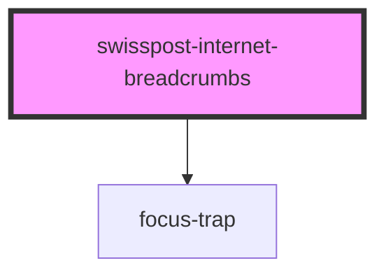

# post-internet-breadcrumbs

<!-- Auto Generated Below -->

## Properties

| Property      | Attribute      | Description                                                                                                                                                                                                                                                                                               | Type                                       | Default     |
| ------------- | -------------- | --------------------------------------------------------------------------------------------------------------------------------------------------------------------------------------------------------------------------------------------------------------------------------------------------------- | ------------------------------------------ | ----------- |
| `customItems` | `custom-items` | **[DEPRECATED]** overlays will no longer be provided in the next major release, therefore this method will no longer be needed.  Add custom breadcrumb items to the end of the pre-configured list. Handy if your online service has its own navigation structure. | `IBreadcrumbItem[] \| string \| undefined` | `undefined` |
| `hideButtons` | `hide-buttons` | **[DEPRECATED]** Help and Contact buttons will no longer be provided in the next major release, therefore this prop will no longer be needed.  Hide all buttons.                                                                                                   | `boolean`                                  | `false`     |

## Methods

### `toggleOverlayById(overlayId: IBreadcrumbOverlay['id']) => Promise<void>`

Toggle an overlay associated with a button.

#### Parameters

| Name        | Type     | Description |
| ----------- | -------- | ----------- |
| `overlayId` | `string` |             |

#### Returns

Type: `Promise<void>`

## Dependencies

### Depends on

- [focus-trap](../shared)

### Graph

----------------------------------------------

*Built with [StencilJS](https://stenciljs.com/)*
