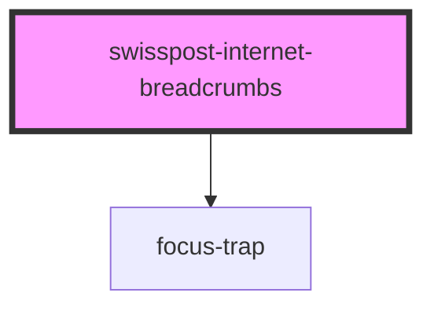

# post-internet-breadcrumbs

<!-- Auto Generated Below -->

## Properties

| Property      | Attribute      | Description       | Type                                       | Default     |
| ------------- | -------------- | ----------------- | ------------------------------------------ | ----------- |
| `customItems` | `custom-items` |                   | `IBreadcrumbItem[] \| string \| undefined` | `undefined` |
| `hideButtons` | `hide-buttons` | Hide all buttons. | `boolean`                                  | `false`     |

## Methods

### `toggleOverlayById(overlayId: IBreadcrumbOverlay['id']) => Promise<void>`

Toggle an overlay associated with a button.

#### Parameters

| Name        | Type     | Description |
| ----------- | -------- | ----------- |
| `overlayId` | `string` |             |

#### Returns

Type: `Promise<void>`

## Dependencies

### Depends on

- [focus-trap](../shared)

### Graph

----------------------------------------------

*Built with [StencilJS](https://stenciljs.com/)*
