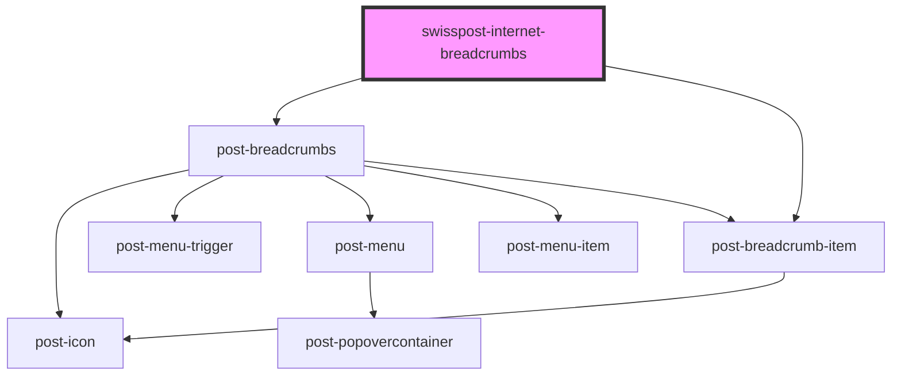

# post-internet-breadcrumbs

<!-- Auto Generated Below -->

## Properties

| Property                       | Attribute          | Description                                                                                                                        | Type                            | Default     |
| ------------------------------ | ------------------ | ---------------------------------------------------------------------------------------------------------------------------------- | ------------------------------- | ----------- |
| `customItems`                  | `custom-items`     | Add custom breadcrumb items to the end of the pre-configured list. Handy if your online service has it's own navigation structure. | `Link[] \| string \| undefined` | `undefined` |
| `textBreadcrumbs` _(required)_ | `text-breadcrumbs` | Accessible label for the breadcrumbs navigation.                                                                                   | `string`                        | `undefined` |
| `textHome` _(required)_        | `text-home`        | Label for the home link.                                                                                                           | `string`                        | `undefined` |
| `textMoreItems` _(required)_   | `text-more-items`  | Label for the overflow menu button.                                                                                                | `string`                        | `undefined` |

## Dependencies

### Depends on

- post-breadcrumbs
- post-breadcrumb-item

### Graph

```mermaid
graph TD;
  swisspost-internet-breadcrumbs --> post-breadcrumbs
  swisspost-internet-breadcrumbs --> post-breadcrumb-item
  post-breadcrumbs --> post-icon
  post-breadcrumbs --> post-menu-trigger
  post-breadcrumbs --> post-menu
  post-breadcrumbs --> post-menu-item
  post-breadcrumbs --> post-breadcrumb-item
  post-menu --> post-popovercontainer
  post-breadcrumb-item --> post-icon
  style swisspost-internet-breadcrumbs fill:#f9f,stroke:#333,stroke-width:4px
```

----------------------------------------------

*Built with [StencilJS](https://stenciljs.com/)*
