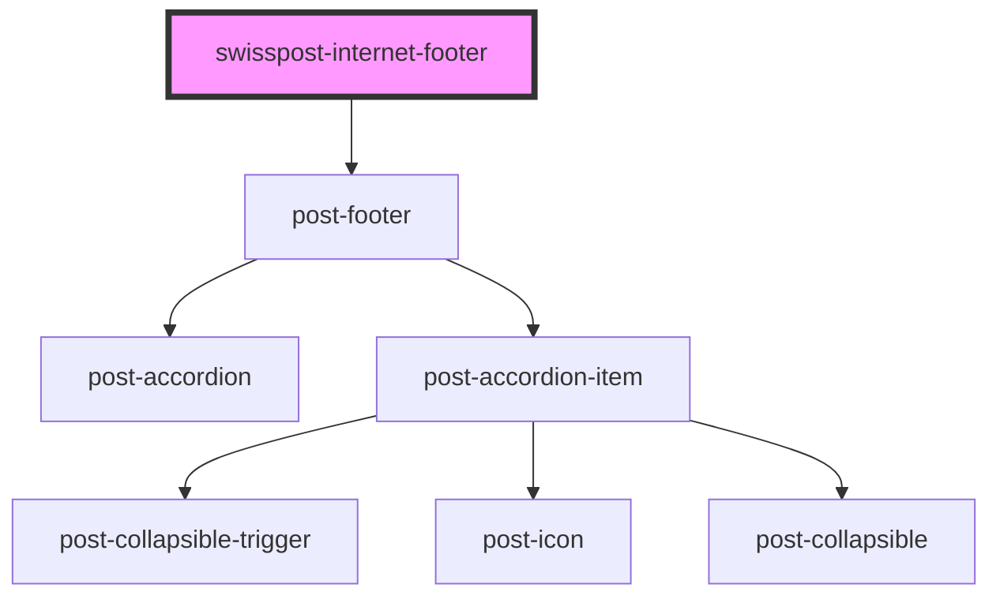

# post-internet-footer

<!-- Auto Generated Below -->

## Properties

| Property                          | Attribute              | Description                             | Type     | Default     |
| --------------------------------- | ---------------------- | --------------------------------------- | -------- | ----------- |
| `textCookieSettings` _(required)_ | `text-cookie-settings` | Label for the "Cookie Settings" button. | `string` | `undefined` |
| `textFooter` _(required)_         | `text-footer`          | Visually hidden label for the footer.   | `string` | `undefined` |

## Dependencies

### Depends on

- post-footer

### Graph

----------------------------------------------

*Built with [StencilJS](https://stenciljs.com/)*
