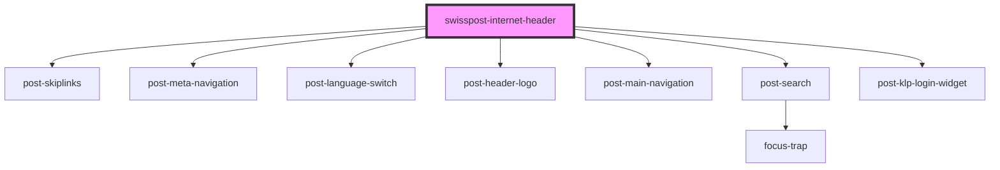

# post-internet-header

<!-- Auto Generated Below -->

## Properties

| Property                  | Attribute                    | Description                                                                                                                                                                                                                                                                                                                                                                                              | Type                                                                      | Default                                |
| ------------------------- | ---------------------------- | -------------------------------------------------------------------------------------------------------------------------------------------------------------------------------------------------------------------------------------------------------------------------------------------------------------------------------------------------------------------------------------------------------- | ------------------------------------------------------------------------- | -------------------------------------- |
| `activeRoute`             | `active-route`               | **[DEPRECATED]** booleans are no longer accepted. Use `"none"` for `false` and `"auto"` for `true`. All other values remain unchanged.  Set the currently activated route. If there is a link matching this URL in the header, it will be highlighted. Will also highlight partly matching URLs. When set to auto, will use current location.href for comparison. | `boolean \| string \| undefined`                                          | `'auto'`                               |
| `configProxy`             | `config-proxy`               | **[DEPRECATED]** this functionality is no longer provided and was deprecated previously.  Define a proxy URL for the config fetch request.                                                                                                                                                                                                                        | `string \| undefined`                                                     | `undefined`                            |
| `customConfig`            | `custom-config`              | **[DEPRECATED]** use the main navigation slot to add custom menu entries.  Customize the header config loaded from the post portal.                                                                                                                                                                                                                               | `ICustomConfig \| string \| undefined`                                    | `undefined`                            |
| `environment`             | `environment`                | Target environment. Choose 'int01' for local testing.                                                                                                                                                                                                                                                                                                                                                    | `"dev01" \| "dev02" \| "devs1" \| "int01" \| "int02" \| "prod" \| "test"` | `'prod'`                               |
| `fullWidth`               | `full-width`                 | **[DEPRECATED]** use the self-managed header for applications.  Displays the header at full width for full-screen applications                                                                                                                                                                                                                                    | `boolean \| undefined`                                                    | `false`                                |
| `language`                | `language`                   | Initial language to be used. Overrides automatic language detection.                                                                                                                                                                                                                                                                                                                                     | `"de" \| "en" \| "fr" \| "it" \| undefined`                               | `undefined`                            |
| `languageCookieKey`       | `language-cookie-key`        | **[DEPRECATED]** due to low usage in favor of a project-specific solution.  The header uses this cookie to set the language. Disables automatic language detection.                                                                                                                                                                                               | `string \| undefined`                                                     | `undefined`                            |
| `languageLocalStorageKey` | `language-local-storage-key` | **[DEPRECATED]** due to low usage in favor of a project-specific solution.  The header uses this local storage key to set the language. Disables automatic language selection.                                                                                                                                                                                    | `string \| undefined`                                                     | `'swisspost-internet-header-language'` |
| `languageSwitchOverrides` | `language-switch-overrides`  | **[DEPRECATED]** use the language menu slot to override the language switch and specify custom URLs.  Override the language switch links with custom URLs. Helpful when your application contains sub-pages, and you would like to stay on subpages when the user changes language.                                                                               | `IAvailableLanguage[] \| string \| undefined`                             | `undefined`                            |
| `login`                   | `login`                      | **[DEPRECATED]** use the new configuration API to show or hide the login.  Toggle the login link (when logged out) or the user widget (when logged in).                                                                                                                                                                                                           | `boolean`                                                                 | `true`                                 |
| `logoutUrl`               | `logout-url`                 | **[DEPRECATED]** use the new configuration API to specify the logout URL.  Overrides the logout-url provided by the portal config.                                                                                                                                                                                                                                | `string \| undefined`                                                     | `undefined`                            |
| `meta`                    | `meta`                       | **[DEPRECATED]** use the new configuration API to show or hide the meta navigation links.  Toggle the meta navigation.                                                                                                                                                                                                                                            | `boolean`                                                                 | `true`                                 |
| `osFlyoutOverrides`       | `os-flyout-overrides`        | **[DEPRECATED]** the new header no longer includes this flyout. Use the main navigation slot to add application-specific menu items.  Online Services only: Add custom links to the special online service navigation entry                                                                                                                                       | `NavMainEntity \| string \| undefined`                                    | `undefined`                            |
| `project`                 | `project`                    | Your project id, previously passed as query string parameter serviceId.                                                                                                                                                                                                                                                                                                                                  | `string`                                                                  | `undefined`                            |
| `search`                  | `search`                     | **[DEPRECATED]** use the new configuration API to show or hide the search.  Toggle the search button.                                                                                                                                                                                                                                                             | `boolean`                                                                 | `true`                                 |
| `selfAdminOrigin`         | `self-admin-origin`          | **[DEPRECATED]** use the new configuration API to specify these URLs.  Overrides the selfadmin url in case it needs to differ from the logoutUrl, which is the url that is used by default. The selfadmin url is used in the KLP login widget to set the user menu links.                                                                                         | `string \| undefined`                                                     | `undefined`                            |
| `skiplinks`               | `skiplinks`                  | **[DEPRECATED]** please implement the skiplinks component.  Toggle skiplinks. They help keyboard users to quickly jump to important sections of the page.                                                                                                                                                                                                         | `boolean`                                                                 | `true`                                 |
| `stickyness`              | `stickyness`                 | **[DEPRECATED]** this option is no longer configurable with the new header.  Sticky behaviour of the header.                                                                                                                                                                                                                                                      | `"full" \| "main" \| "minimal" \| "none"`                                 | `'minimal'`                            |

## Events

| Event          | Description                                          | Type                |
| -------------- | ---------------------------------------------------- | ------------------- |
| `headerLoaded` | Fires when the header has been rendered to the page. | `CustomEvent<void>` |

## Methods

### `getCurrentLanguage() => Promise<'de' | 'fr' | 'it' | 'en' | string>`

**[DEPRECATED]** use `document.documentElement.lang` instead  Get the currently set language as a two letter string ("de", "fr" "it" or "en")

#### Returns

Type: `Promise<string>`

string

## Dependencies

### Depends on

- [post-skiplinks](../post-skiplinks)
- [post-meta-navigation](../post-meta-navigation)
- [post-language-switch](../post-language-switch)
- [post-header-logo](../post-logo)
- [post-main-navigation](../post-main-navigation)
- [post-search](../post-search)
- [post-klp-login-widget](../post-klp-login-widget)

### Graph

----------------------------------------------

*Built with [StencilJS](https://stenciljs.com/)*
