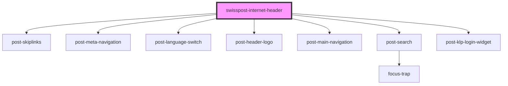

# post-internet-header

<!-- Auto Generated Below -->

## Properties

| Property                  | Attribute                    | Description                                                                                                                                                                                                               | Type                                                                      | Default                                |
| ------------------------- | ---------------------------- | ------------------------------------------------------------------------------------------------------------------------------------------------------------------------------------------------------------------------- | ------------------------------------------------------------------------- | -------------------------------------- |
| `activeRoute`             | `active-route`               | Set the currently activated route. If there is a link matching this URL in the header, it will be highlighted. Will also highlight partly matching URLs. When set to auto, will use current location.href for comparison. | `boolean \| string \| undefined`                                          | `'auto'`                               |
| `configProxy`             | `config-proxy`               | DEPRECATED!: Define a proxy URL for the config fetch request. Will be removed in the next major version                                                                                                                   | `string \| undefined`                                                     | `undefined`                            |
| `customConfig`            | `custom-config`              | Customize the header config loaded from the post portal.                                                                                                                                                                  | `ICustomConfig \| string \| undefined`                                    | `undefined`                            |
| `environment`             | `environment`                | Target environment. Choose 'int01' for local testing.                                                                                                                                                                     | `"dev01" \| "dev02" \| "devs1" \| "int01" \| "int02" \| "prod" \| "test"` | `'prod'`                               |
| `fullWidth`               | `full-width`                 | Displays the header at full width for full-screen applications                                                                                                                                                            | `boolean \| undefined`                                                    | `false`                                |
| `language`                | `language`                   | Initial language to be used. Overrides automatic language detection.                                                                                                                                                      | `"de" \| "en" \| "fr" \| "it" \| undefined`                               | `undefined`                            |
| `languageCookieKey`       | `language-cookie-key`        | The header uses this cookie to set the language. Disables automatic language detection.                                                                                                                                   | `string \| undefined`                                                     | `undefined`                            |
| `languageLocalStorageKey` | `language-local-storage-key` | The header uses this local storage key to set the language. Disables automatic language selection.                                                                                                                        | `string \| undefined`                                                     | `'swisspost-internet-header-language'` |
| `languageSwitchOverrides` | `language-switch-overrides`  | Override the language switch links with custom URLs. Helpful when your application contains sub-pages, and you would like to stay on subpages when the user changes language.                                             | `IAvailableLanguage[] \| string \| undefined`                             | `undefined`                            |
| `login`                   | `login`                      | Toggle the login link (when logged out) or the user widget (when logged in).                                                                                                                                              | `boolean`                                                                 | `true`                                 |
| `logoutUrl`               | `logout-url`                 | Override the logout-url provided by the portal config.                                                                                                                                                                    | `string \| undefined`                                                     | `undefined`                            |
| `meta`                    | `meta`                       | Toggle the meta navigation.                                                                                                                                                                                               | `boolean`                                                                 | `true`                                 |
| `osFlyoutOverrides`       | `os-flyout-overrides`        | Online Services only: Add custom links to the special online service navigation entry                                                                                                                                     | `NavMainEntity \| string \| undefined`                                    | `undefined`                            |
| `project`                 | `project`                    | Your project id, previously passed as query string parameter serviceId.                                                                                                                                                   | `string`                                                                  | `undefined`                            |
| `search`                  | `search`                     | Toggle the search button.                                                                                                                                                                                                 | `boolean`                                                                 | `true`                                 |
| `skiplinks`               | `skiplinks`                  | Toggle skiplinks. They help keyboard users to quickly jump to important sections of the page.                                                                                                                             | `boolean`                                                                 | `true`                                 |
| `stickyness`              | `stickyness`                 | Sticky behaviour of the header.                                                                                                                                                                                           | `"full" \| "main" \| "minimal" \| "none"`                                 | `'minimal'`                            |

## Events

| Event          | Description                                          | Type                |
| -------------- | ---------------------------------------------------- | ------------------- |
| `headerLoaded` | Fires when the header has been rendered to the page. | `CustomEvent<void>` |

## Methods

### `getCurrentLanguage() => Promise<'de' | 'fr' | 'it' | 'en' | string>`

Get the currently set language as a two letter string ("de", "fr" "it" or "en")

#### Returns

Type: `Promise<string>`

string

## Dependencies

### Depends on

- [post-skiplinks](../post-skiplinks)
- [post-meta-navigation](../post-meta-navigation)
- [post-language-switch](../post-language-switch)
- [post-header-logo](../post-logo)
- [post-main-navigation](../post-main-navigation)
- [post-search](../post-search)
- [post-klp-login-widget](../post-klp-login-widget)

### Graph

----------------------------------------------

*Built with [StencilJS](https://stenciljs.com/)*
