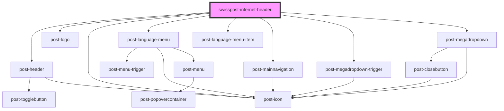

# post-internet-header

<!-- Auto Generated Below -->

## Properties

| Property      | Attribute      | Description                                                                                                                                                                                                               | Type                                                                      | Default     |
| ------------- | -------------- | ------------------------------------------------------------------------------------------------------------------------------------------------------------------------------------------------------------------------- | ------------------------------------------------------------------------- | ----------- |
| `activeRoute` | `active-route` | Set the currently activated route. If there is a link matching this URL in the header, it will be highlighted. Will also highlight partly matching URLs. When set to auto, will use current location.href for comparison. | `string \| undefined`                                                     | `'auto'`    |
| `environment` | `environment`  | Target environment. Choose 'int01' for local testing.                                                                                                                                                                     | `"dev01" \| "dev02" \| "devs1" \| "int01" \| "int02" \| "prod" \| "test"` | `'prod'`    |
| `fullWidth`   | `full-width`   | Displays the header at full width for full-screen applications                                                                                                                                                            | `boolean \| undefined`                                                    | `false`     |
| `language`    | `language`     | Initial language to be used. Overrides automatic language detection.                                                                                                                                                      | `"de" \| "en" \| "fr" \| "it" \| undefined`                               | `undefined` |
| `project`     | `project`      | Your project id, previously passed as query string parameter serviceId.                                                                                                                                                   | `string`                                                                  | `undefined` |

## Events

| Event          | Description                                          | Type                |
| -------------- | ---------------------------------------------------- | ------------------- |
| `headerLoaded` | Fires when the header has been rendered to the page. | `CustomEvent<void>` |

## Dependencies

### Depends on

- post-header
- post-logo
- post-icon
- post-language-menu
- post-language-menu-item
- post-mainnavigation
- post-megadropdown-trigger
- post-megadropdown

### Graph

```mermaid
graph TD;
  swisspost-internet-header --> post-header
  swisspost-internet-header --> post-logo
  swisspost-internet-header --> post-icon
  swisspost-internet-header --> post-language-menu
  swisspost-internet-header --> post-language-menu-item
  swisspost-internet-header --> post-mainnavigation
  swisspost-internet-header --> post-megadropdown-trigger
  swisspost-internet-header --> post-megadropdown
  post-header --> post-togglebutton
  post-header --> post-icon
  post-language-menu --> post-menu-trigger
  post-language-menu --> post-icon
  post-language-menu --> post-menu
  post-menu --> post-popovercontainer
  post-mainnavigation --> post-icon
  post-megadropdown-trigger --> post-icon
  post-megadropdown --> post-closebutton
  post-megadropdown --> post-icon
  post-closebutton --> post-icon
  style swisspost-internet-header fill:#f9f,stroke:#333,stroke-width:4px
```

----------------------------------------------

*Built with [StencilJS](https://stenciljs.com/)*
