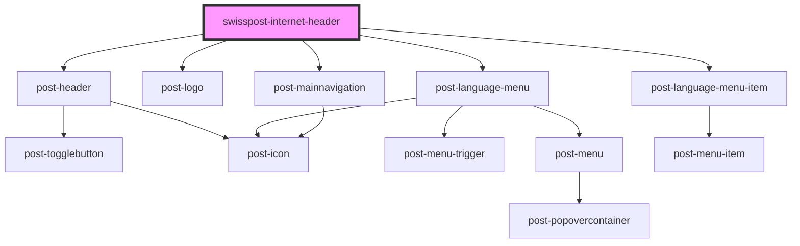

# post-internet-header

<!-- Auto Generated Below -->

## Properties

| Property                           | Attribute               | Description                                                                                                                                                                                                               | Type                                                                      | Default     |
| ---------------------------------- | ----------------------- | ------------------------------------------------------------------------------------------------------------------------------------------------------------------------------------------------------------------------- | ------------------------------------------------------------------------- | ----------- |
| `activeRoute`                      | `active-route`          | Set the currently activated route. If there is a link matching this URL in the header, it will be highlighted. Will also highlight partly matching URLs. When set to auto, will use current location.href for comparison. | `string`                                                                  | `'auto'`    |
| `environment`                      | `environment`           | Target environment. Choose 'int01' for local testing.                                                                                                                                                                     | `"dev01" \| "dev02" \| "devs1" \| "int01" \| "int02" \| "prod" \| "test"` | `'prod'`    |
| `fullWidth`                        | `full-width`            | Makes the header content span the full width on screens larger than 1440px.                                                                                                                                               | `boolean`                                                                 | `false`     |
| `language`                         | `language`              | Initial language to be used. Overrides automatic language detection.                                                                                                                                                      | `"de" \| "en" \| "fr" \| "it" \| undefined`                               | `undefined` |
| `project` _(required)_             | `project`               | Your project id, previously passed as query string parameter serviceId.                                                                                                                                                   | `string`                                                                  | `undefined` |
| `textBack` _(required)_            | `text-back`             | Visually hidden label for the back button.                                                                                                                                                                                | `string`                                                                  | `undefined` |
| `textChangeLanguage` _(required)_  | `text-change-language`  | Visually hidden label for the language menu.                                                                                                                                                                              | `string`                                                                  | `undefined` |
| `textClose` _(required)_           | `text-close`            | Visually hidden label for the close button.                                                                                                                                                                               | `string`                                                                  | `undefined` |
| `textCurrentLanguage` _(required)_ | `text-current-language` | Visually hidden label for the current language.                                                                                                                                                                           | `string`                                                                  | `undefined` |
| `textCurrentUser` _(required)_     | `text-current-user`     | Visually hidden label for the current user.                                                                                                                                                                               | `string`                                                                  | `undefined` |
| `textMain` _(required)_            | `text-main`             | Visually hidden label for the main navigation element.                                                                                                                                                                    | `string`                                                                  | `undefined` |
| `textMenu` _(required)_            | `text-menu`             | Visually hidden label for the burger menu button.                                                                                                                                                                         | `string`                                                                  | `undefined` |
| `textUserLinks` _(required)_       | `text-user-links`       | Visually hidden label for the user menu.                                                                                                                                                                                  | `string`                                                                  | `undefined` |

## Events

| Event          | Description                                          | Type                |
| -------------- | ---------------------------------------------------- | ------------------- |
| `headerLoaded` | Fires when the header has been rendered to the page. | `CustomEvent<void>` |

## Dependencies

### Depends on

- post-header
- post-logo
- post-language-menu
- post-language-menu-item
- post-mainnavigation

### Graph

```mermaid
graph TD;
  swisspost-internet-header --> post-header
  swisspost-internet-header --> post-logo
  swisspost-internet-header --> post-language-menu
  swisspost-internet-header --> post-language-menu-item
  swisspost-internet-header --> post-mainnavigation
  post-header --> post-togglebutton
  post-header --> post-icon
  post-language-menu --> post-menu-trigger
  post-language-menu --> post-icon
  post-language-menu --> post-menu
  post-menu --> post-popovercontainer
  post-language-menu-item --> post-menu-item
  post-mainnavigation --> post-icon
  style swisspost-internet-header fill:#f9f,stroke:#333,stroke-width:4px
```

----------------------------------------------

*Built with [StencilJS](https://stenciljs.com/)*
