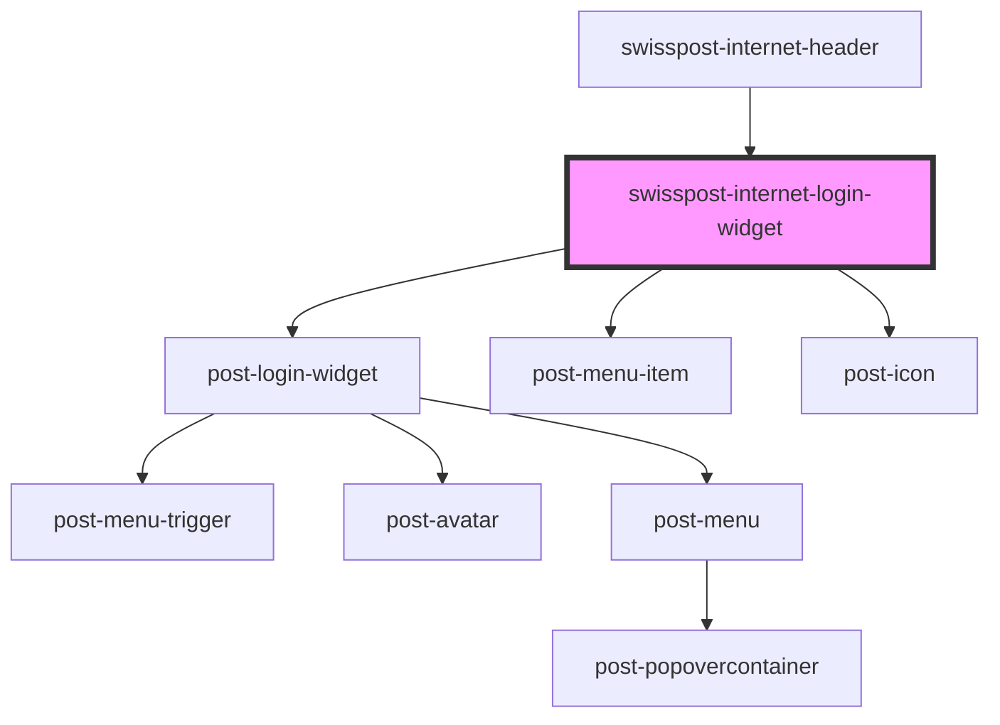

# swisspost-internet-login-widget

<!-- Auto Generated Below -->

## Properties

| Property                           | Attribute                | Description                                                                                                                                                    | Type     | Default     |
| ---------------------------------- | ------------------------ | -------------------------------------------------------------------------------------------------------------------------------------------------------------- | -------- | ----------- |
| `textCurrentUser` _(required)_     | `text-current-user`      | Label for the "Current user is {user}" accessibility description. Use `{user}` as a placeholder — it will be replaced with the current user's name at runtime. | `string` | `undefined` |
| `textUserMenu` _(required)_        | `text-user-menu`         | Accessible label for the dropdown menu.                                                                                                                        | `string` | `undefined` |
| `textUserMenuTrigger` _(required)_ | `text-user-menu-trigger` | Hidden label for the user menu trigger button, for accessibility purposes.                                                                                     | `string` | `undefined` |

## Dependencies

### Used by

 - [swisspost-internet-header](../post-internet-header)

### Depends on

- post-login-widget
- post-menu-item
- post-icon

### Graph

----------------------------------------------

*Built with [StencilJS](https://stenciljs.com/)*
