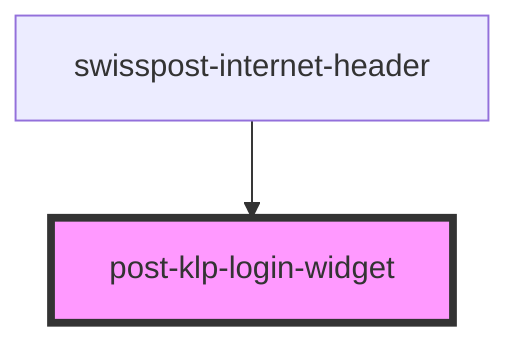

# post-klp-login-widget

<!-- Auto Generated Below -->

## Properties

| Property    | Attribute    | Description                                            | Type                  | Default     |
| ----------- | ------------ | ------------------------------------------------------ | --------------------- | ----------- |
| `logoutUrl` | `logout-url` | Override the logout-url provided by the portal config. | `string \| undefined` | `undefined` |

## Methods

### `setFocus() => Promise<void>`

Sets the focus on the login button

#### Returns

Type: `Promise<void>`

## Dependencies

### Used by

 - [swisspost-internet-header](../post-internet-header)

### Graph

----------------------------------------------

*Built with [StencilJS](https://stenciljs.com/)*
