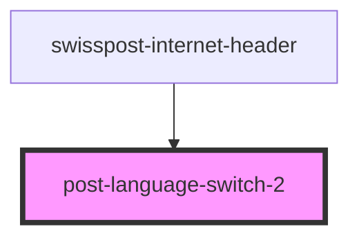

# post-language-switch-2

<!-- Auto Generated Below -->

## Properties

| Property | Attribute | Description                                                                 | Type                   | Default     |
| -------- | --------- | --------------------------------------------------------------------------- | ---------------------- | ----------- |
| `mode`   | `mode`    | Visualization of the language switch. Possible values: 'dropdown' \| 'list' | `"dropdown" \| "list"` | `undefined` |

## Events

| Event             | Description                               | Type                                                        |
| ----------------- | ----------------------------------------- | ----------------------------------------------------------- |
| `dropdownToggled` | Fires when the dropdown has been toggled. | `CustomEvent<{ open: boolean; element: DropdownElement; }>` |
| `languageChanged` | Fires when the language has been changed. | `CustomEvent<string>`                                       |

## Methods

### `toggleDropdown(force?: boolean) => Promise<boolean>`

Open or close the language switch programatically

#### Parameters

| Name    | Type                   | Description              |
| ------- | ---------------------- | ------------------------ |
| `force` | `boolean \| undefined` | Boolean to force a state |

#### Returns

Type: `Promise<boolean>`

Boolean indicating new state

## Dependencies

### Used by

 - [swisspost-internet-header](../post-internet-header)

### Graph

----------------------------------------------

*Built with [StencilJS](https://stenciljs.com/)*
