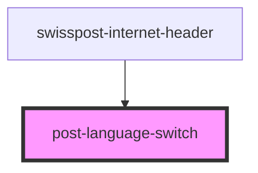

# post-language-switch

<!-- Auto Generated Below -->

## Properties

| Property | Attribute | Description | Type                   | Default     |
| -------- | --------- | ----------- | ---------------------- | ----------- |
| `mode`   | `mode`    |             | `"dropdown" \| "list"` | `undefined` |

## Events

| Event             | Description | Type                                                        |
| ----------------- | ----------- | ----------------------------------------------------------- |
| `dropdownToggled` |             | `CustomEvent<{ open: boolean; element: DropdownElement; }>` |
| `languageChanged` |             | `CustomEvent<string>`                                       |

## Methods

### `toggleDropdown(force?: boolean) => Promise<boolean>`

#### Returns

Type: `Promise<boolean>`

## Dependencies

### Used by

 - [swisspost-internet-header](../post-internet-header)

### Graph

----------------------------------------------

*Built with [StencilJS](https://stenciljs.com/)*
