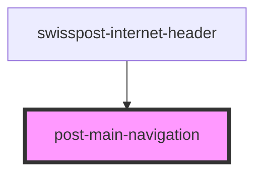

# post-main-navigation

<!-- Auto Generated Below -->

## Events

| Event             | Description | Type                                                        |
| ----------------- | ----------- | ----------------------------------------------------------- |
| `dropdownToggled` |             | `CustomEvent<{ open: boolean; element: DropdownElement; }>` |
| `flyoutToggled`   |             | `CustomEvent<null \| string>`                               |

## Methods

### `setActiveFlyout(id: string | null) => Promise<void>`

Open a specific flyout

#### Parameters

| Name | Type             | Description |
| ---- | ---------------- | ----------- |
| `id` | `string \| null` | Flyout ID   |

#### Returns

Type: `Promise<void>`

### `setFocus() => Promise<void>`

Focus the main navigation toggle button

#### Returns

Type: `Promise<void>`

### `toggleDropdown(force?: boolean) => Promise<boolean>`

Toggle the main navigation (only visible on mobile)

#### Parameters

| Name    | Type                   | Description   |
| ------- | ---------------------- | ------------- |
| `force` | `boolean \| undefined` | Force a state |

#### Returns

Type: `Promise<boolean>`

Boolean indicating new state

## Dependencies

### Used by

 - [swisspost-internet-header](../post-internet-header)

### Graph

----------------------------------------------

*Built with [StencilJS](https://stenciljs.com/)*
