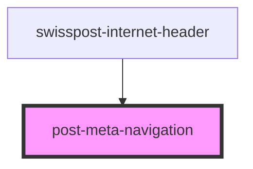

# post-meta-navigation

<!-- Auto Generated Below -->

## Properties

| Property      | Attribute     | Description                                                                                         | Type                         | Default     |
| ------------- | ------------- | --------------------------------------------------------------------------------------------------- | ---------------------------- | ----------- |
| `fullWidth`   | `full-width`  | Displays the meta-navigation in full-width.                                                         | `boolean \| undefined`       | `false`     |
| `orientation` | `orientation` | Displays the meta-navigation horihontally or vertically. Allowed values: 'horizontal' \| 'vertical' | `"horizontal" \| "vertical"` | `undefined` |

## Dependencies

### Used by

 - [swisspost-internet-header](../post-internet-header)

### Graph

----------------------------------------------

*Built with [StencilJS](https://stenciljs.com/)*
