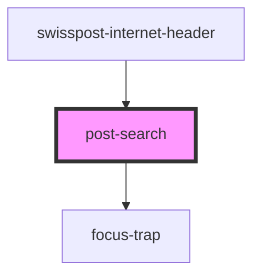

# post-search

<!-- Auto Generated Below -->

## Events

| Event             | Description | Type                                                        |
| ----------------- | ----------- | ----------------------------------------------------------- |
| `dropdownToggled` |             | `CustomEvent<{ open: boolean; element: DropdownElement; }>` |

## Methods

### `setFocus() => Promise<void>`

Sets the focus on the search button

#### Returns

Type: `Promise<void>`

### `toggleDropdown(force?: unknown) => Promise<boolean>`

Toggle the dropdown and optionally force an open/closed state

#### Parameters

| Name    | Type      | Description                        |
| ------- | --------- | ---------------------------------- |
| `force` | `unknown` | Boolean to force open/closed state |

#### Returns

Type: `Promise<boolean>`

Boolean indicating open state of the component

## Dependencies

### Used by

 - [swisspost-internet-header](../post-internet-header)

### Depends on

- [focus-trap](../shared)

### Graph

----------------------------------------------

*Built with [StencilJS](https://stenciljs.com/)*
